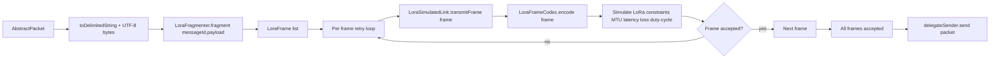
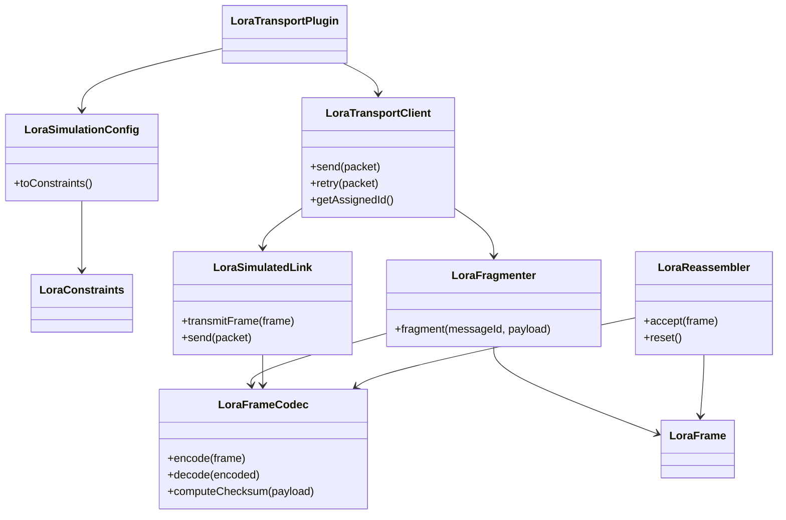

# LoRa Package Data Flow

This document explains how data moves through the LoRa simulation package and where each class participates in serialization, framing, transport encoding, simulation, and reassembly.

## Scope

Main package areas:

- `lora.plugin` (transport plugin and client)
- `lora.protocol` (frame model, codec, fragmentation, reassembly)
- `lora.simulation` (LoRa-like link constraints)
- `lora.config` / `lora.model` (constraints loading and immutable constraint values)

---

## End-to-end send flow



### Notes

- Fragmentation is performed on UTF-8 bytes of the full packet string.
- `LoraFrameCodec` is frame-level only (single frame in/out), not whole-message fragmentation.
- MTU fit checks in `LoraFragmenter` use encoded frame size (`codec.encode(frame)` + UTF-8 byte length) to approximate wire cost.
- Current `LoraTransportClient` flow first simulates/sends each frame, then calls `delegateSender.send(packet)` for the packet send.

---

## Frame structure and codec behavior

`LoraFrameCodec.encode(frame)` emits a compact delimited transport string:

`LORA1|messageId|fragmentIndex|isLast|payloadBase64|checksumHex`

Where:

- `payloadBase64` is the frame payload chunk bytes encoded in Base64.
- `checksumHex` is CRC32 over the raw payload chunk bytes.
- `isLast` is `1` or `0`.

`LoraFrameCodec.decode(encoded)` validates:

1. Non-blank input
2. Correct field count and version
3. Numeric fields (`fragmentIndex`, checksum)
4. Base64 payload decode
5. Checksum match (`frame.verifyChecksum(codec)`)

---

## Receive/reassembly flow (protocol layer)

```mermaid
flowchart LR
    A[Encoded frame string] --> B[LoraFrameCodec.decode]
    B --> C[LoraFrame]
    C --> D[LoraReassembler.accept]
    D --> E{Complete message?}
    E -- no --> F[Wait for more frames]
    E -- yes --> G[Assemble ordered chunks]
    G --> H[byte[] message payload]
    H --> I[UTF-8 decode back to packet string]
```

### Reassembler rules

- Enforces single active `messageId` per stream.
- Accepts duplicates only when payload bytes are identical.
- Tracks `lastFragmentIndex` and requires a contiguous index set `0..last` before assembly.
- Resets internal state after successful assembly.

---

## Class interaction diagram



---

## Responsibility boundaries

- **Message serialization**: packet string ↔ UTF-8 bytes (outside `LoraFrameCodec`)
- **Fragmentation**: `LoraFragmenter`
- **Frame wire encoding/decoding**: `LoraFrameCodec`
- **Constraint simulation + frame transmission gate**: `LoraSimulatedLink`
- **Reassembly**: `LoraReassembler`

Keeping these boundaries separate makes behavior easier to test and lets framing/wire format evolve independently from packet serialization.
